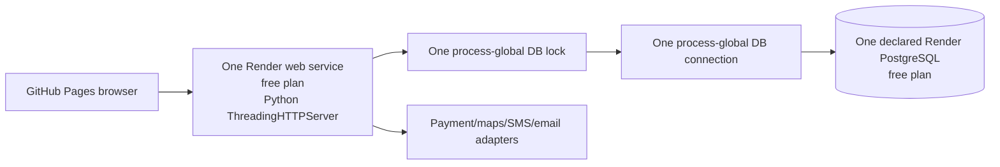
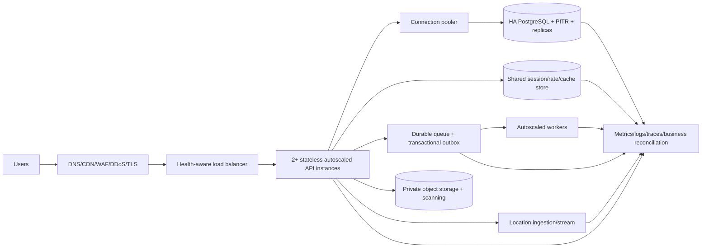

# LiftHaul performance, scalability, and infrastructure-stability report

Date: 2026-09-07  
Repository baseline: `bd89704` on `codex/hostile-product-audit`  
Decision: **NO-GO for production or live funds**

## 1. Executive summary

LiftHaul has useful correctness controls and broad unit coverage, but the deployed design is not a
stable production platform. Nearly all routed requests share one database connection and one global
mutex. The declared hosting blueprint contains one free web service and one free database, with no
evidenced multi-instance application tier, database high availability, shared limiter/cache, durable
infrastructure queue, worker tier, object storage, production restore drill, or business-aware
observability.

The clean local measurements establish a first technical baseline:

- A read-only mix remained under the provisional p95/error gates through 500 concurrent clients,
  although it already produced 0.8% connection failures and a 2.050-second p99.
- At 1,000 concurrent clients, the read-only mix failed: **p95 2.032 seconds, p99 2.055 seconds, 1.6%
  errors**, and throughput fell from 311.7 requests/second at the preceding stage to 294.5.
- At only 100 concurrent clients, the required mixed business workload failed: **p95 3.105 seconds,
  p99 3.111 seconds, and 16% errors**. All recorded business errors were HTTP 429 responses caused by
  the 20-public-POSTs-per-minute socket-IP limiter; 8 of 10 booking submissions were rejected.
- Twenty concurrent retries of one booking passed on one process and returned one booking reference.
  This does not clear multi-instance safety: the earlier 24-connection hostile probe persisted two
  bookings once because the public idempotency check has no atomic uniqueness constraint.
- Forty-two focused payment, webhook, refund, release, red-team, and booking-idempotency tests passed
  in 22.72 seconds. This is positive unit/mock evidence, not a production load result.
- A local SQLite backup/destroy/restore/reconcile drill passed with a 0.36-second restore. The
  PostgreSQL mode only prints a playbook, so managed PostgreSQL RTO/RPO remain unproven.

The approved production capacity is therefore **unknown, not 500 users**. Loopback SQLite results
cannot be extrapolated to Internet traffic, managed PostgreSQL, live payment/map providers, multiple
instances, mature data, or long-duration operation.

## 2. Infrastructure diagram

### Current declared deployment

### Required production direction

The complete design and failure behavior are in [TARGET_ARCHITECTURE.md](TARGET_ARCHITECTURE.md).

## 3. Test-environment specification

| Property | Local measured environment | Production-parity requirement |
|---|---|---|
| Host | Windows workstation, loopback network | Dedicated isolated performance environment |
| Runtime | Python 3.14 stdlib HTTP server | Same runtime/container/process model as production |
| API instances | One verified listener/process | At least two across failure domains plus autoscaling |
| Database | Local SQLite file | Managed PostgreSQL HA, pooler, production-like size/indexes |
| Data | Seed/synthetic, small | Synthetic mature-volume datasets |
| External APIs | Disabled/mock/rejection boundaries | Sandboxes/fault proxies with measured latency and quotas |
| Load generator | Dependency-free Python threads on same host | Distributed k6 generators outside the application network |
| Monitoring | Process snapshot and JSON client evidence | Metrics, logs, traces, resource and business dashboards |
| k6/Docker/Locust | Not installed on audit host | Installed and version-pinned in performance runner |

These limitations deliberately prevent any claim of production capacity or nationwide readiness.

## 4. Workload model

The supplied k6 test implements the mandated distribution:

| Activity | Share | Local probe coverage | Production-parity requirement |
|---|---:|---|---|
| Browse/check rates | 25% | Public service-level reads | CDN plus real public/catalog pages |
| Register/sign in | 15% | Demo staff sign-in | Distinct client/provider/driver/staff identities and MFA |
| Cargo/route entry | 15% | Vehicle-recommendation command | Map/geocode sandbox and realistic address data |
| Vehicle recommendation | 10% | Recommendation command | Full verified fleet/capacity/service-area data |
| Create/update booking | 10% | Synthetic public booking | Authenticated draft/amendment/confirm lifecycle |
| Fund protected payment | 5% | Channel-read boundary only | Provider sandbox session and client completion |
| Process webhook | 5% | Forged webhook rejection | Signed matched/duplicate/delayed/burst fixtures |
| Track delivery | 5% | Tracking token read | Real location stream and many active trips |
| Upload document/POD | 5% | Public upload boundary only | Signed object upload, malware scan, metadata workflow |
| Fleet management | 3% | Vehicle-taxonomy read | Seeded 1/10/100-vehicle fleet operations |
| Staff/admin | 2% | Operations sign-in | Role-specific queues, dispute, payment, compliance work |

Because several journeys require environment-specific fixtures, the local mixed result is a
diagnostic, not end-to-end journey certification. The k6 harness exposes variables for those fixtures
and refuses mutations unless the operator explicitly identifies a synthetic environment.

## 5. Concurrent-user levels

| Concurrent clients | Profile | Requests | Result |
|---:|---|---:|---|
| 1 | Read | 2 | Pass |
| 25 | Read | 50 | Pass |
| 100 | Read | 200 | Pass |
| 500 | Read | 1,000 | Pass at provisional p95/error thresholds, with warning |
| 1,000 | Read stress | 1,000 | **Fail** |
| 100 | Mixed business diagnostic | 100 plus one setup booking | **Fail** |
| 20 | Same-key booking retry | 20 | Pass on one globally locked process only |
| 2,500 / 5,000 / 10,000 | Full mixed | Not executed | Blocked by failure at lower stages and absent production-parity environment |

Stopping at the first failed stage avoids producing meaningless higher numbers on a non-parity
workstation. The k6 stages remain ready for the corrected dedicated environment.

## 6. Transaction volumes

- Clean read progression: 1,252 requests across four stages plus 1,000 requests at the stress stage.
- Clean mixed diagnostic: 100 requests at 30.729 requests/second, plus one setup booking.
- Booking retry: 20 simultaneous requests at 15.479 requests/second.
- Focused correctness suite: 42 payment/protected-payment/public-booking tests.
- No live payment, payout, refund, map, notification, document, or location-provider traffic was
  generated. Those results are required before production approval.

## 7. Response-time percentiles

### Clean read workload

| Concurrency | Median | p95 | p99 | Max |
|---:|---:|---:|---:|---:|
| 1 | 55.882 ms | 84.599 ms | 84.599 ms | 84.599 ms |
| 25 | 28.297 ms | 531.431 ms | 1,027.981 ms | 1,027.981 ms |
| 100 | 25.270 ms | 555.242 ms | 1,032.461 ms | 1,035.507 ms |
| 500 | 25.646 ms | 1,556.692 ms | 2,049.955 ms | 2,067.970 ms |
| 1,000 | 27.787 ms | **2,031.622 ms** | **2,054.975 ms** | 2,273.254 ms |

### Business and integrity diagnostics

| Profile | Concurrency | Median | p95 | p99 | Result |
|---|---:|---:|---:|---:|---|
| Mixed | 100 | 1,461.179 ms | **3,105.277 ms** | **3,111.416 ms** | Fail |
| Same-key booking retry | 20 | 412.421 ms | 1,050.476 ms | 1,074.860 ms | One-process pass |

## 8. Throughput

| Profile/concurrency | Throughput | Interpretation |
|---|---:|---|
| Read / 1 | 16.945 req/s | Baseline is dominated by client/startup overhead |
| Read / 25 | 45.221 req/s | No errors |
| Read / 100 | 155.072 req/s | No errors |
| Read / 500 | 311.748 req/s | Near local plateau; connection errors begin |
| Read / 1,000 | 294.534 req/s | Throughput regresses while latency/errors breach |
| Mixed / 100 | 30.729 req/s | CPU-heavy sign-in plus serialization and throttling |
| Same-key booking retry / 20 | 15.479 req/s | Serialized by the global lock |

## 9. Error rates

| Profile/concurrency | Error rate | Error type |
|---|---:|---|
| Read / 1–100 | 0% | None |
| Read / 500 | 0.8% | Connection refused |
| Read / 1,000 | **1.6%** | Connection refused |
| Mixed / 100 | **16%** | HTTP 429 public limiter |
| Same-key retry / 20 | 0% | None in the single process |

The mixed run deliberately treats a forged webhook's HTTP 403 as a successful security result. It is
not included as an error.

## 10. Resource utilization

After the clean read progression and 1,000-client stress run, the server process showed approximately
54.8 MB working set, 45.7 MB private memory, 138 handles, and 11.55 CPU seconds since start. The test
did not capture high-frequency peak CPU, memory, network, disk I/O, connection counts, or lock-wait
histograms. A post-test snapshot cannot prove absence of saturation. Production-parity tests must
export these metrics continuously and align them to load stages.

## 11. Database findings

1. `backend/server.py:123` opens one global connection.
2. `backend/server.py:124` defines one global database lock and line 2956 takes it around nearly every
   routed operation. Thread concurrency therefore does not create business-operation concurrency.
3. Public booking idempotency at `backend/public_booking.py:699-704` uses select-before-create without
   an evidenced unique constraint. The earlier multi-connection probe reproduced two rows.
4. Payment gateway tables do contain useful unique constraints for provider references,
   booking/idempotency pairs, active payments, and refunds. These controls require multi-instance
   PostgreSQL race testing, not only unit tests.
5. Driver GPS ingestion derives the next sequence using `MAX(seq)+1` and writes every raw ping to the
   transactional database, a concurrency and scale risk.
6. No pool saturation, slow-query, lock-wait, index-bloat, replica-lag, or mature-data results exist.

## 12. Queue and cache findings

The code includes database-backed retry/dead-letter concepts for some webhooks and integrations, but
the deployment declares no durable queue service, background-worker service, or managed shared
cache. Notifications, reports, documents, reconciliation, and external-provider work therefore lack
an evidenced isolation/scaling plane. Login/API/public rate limits use process memory, so they reset
on restart and disagree across replicas. Payment state and balances correctly must remain database
authoritative; only sessions, limits, reference data, and safe aggregates belong in cache.

## 13. External-API findings

Provider-neutral adapters include circuit-breaker and exponential-backoff concepts. No live or
production-sandbox evidence exists for payment, mapping, geocoding, SMS, email, identity, document,
government, analytics, or accounting providers. Required next tests inject timeouts, 429s, invalid
signatures, stale/duplicate callbacks, high latency, partial responses, DNS failure, and recovery.
Every provider needs a bounded timeout, capped exponential backoff with jitter, circuit breaker,
durable retry, and non-duplicating idempotency policy.

## 14. Financial-integrity results

Positive evidence:

- 42 focused tests passed, including invalid/duplicate/stale webhook behavior, amount mismatch,
  refund uncertainty, release gates, reconciliation, and public booking replay.
- The forged local webhook was rejected in all five mixed requests.
- Twenty concurrent same-key HTTP booking submissions returned one logical booking reference on one
  process.

Blocking evidence:

- The one-process HTTP result is serialized by the global mutex and cannot represent multiple API
  instances.
- The prior 24-connection probe persisted two public bookings once for one idempotency key.
- No signed payment-provider load, duplicate webhook burst, simultaneous dispute/release, repeated
  refund, payout failure, or reconciliation under failover was executed.
- Live funds remain correctly disabled. They must stay disabled.

## 15. Breaking point

There are two distinct breaking points:

- **Business usability:** the mixed profile fails at 100 concurrent clients because the entire public
  surface shares a 20-POST/minute limiter keyed to the observed socket IP. In a corporate network or
  behind a misconfigured reverse proxy, unrelated users can throttle one another.
- **Raw read capacity:** the first formally failed measured stage is 1,000 concurrent clients. The
  error threshold and p95 target both fail, and throughput falls below the 500-client result.

The maximum sustainable production load is not known. The 500-client local read pass is not a safe
operating capacity.

## 16. Recovery results

- The API process and listening socket remained alive after the read stress run. This proves only
  process survival, not transaction recovery.
- SQLite backup/destroy/restore/reconcile passed; measured restore time was 0.36 seconds and the
  seeded fingerprint matched. This is development evidence only.
- No managed PostgreSQL failover/restore, cache/queue loss, zone loss, regional recovery, webhook
  backlog drain, or post-overload business reconciliation has been executed.
- Proposed objectives are RPO ≤5 minutes for the transactional database, zero loss of acknowledged
  webhook events, RTO ≤30 minutes for zone failure, and RTO ≤4 hours for regional disaster. Business
  owners must approve them and SRE must prove them.

## 17. Bottleneck analysis

The most immediate bottleneck is architectural serialization, not server size. The request server
creates threads, but one global lock protects one global database connection. At high concurrency,
clients wait in the OS/network backlog; some connections are refused. Adding CPU or memory without
changing the connection/transaction model will not create proportional throughput.

The next bottlenecks are the process-local public limiter, single application/database deployment,
absence of isolated workers/queue/cache, synchronous password hashing during login, raw location
writes, and lack of mature-data query evidence. The mixed workload's p95 is also inflated by 17 sign-
ins sharing the serialized request path.

## 18. Capacity recommendation

Approved production capacity: **none yet**. Recommended sequence:

1. Make booking/payment/assignment commands atomically idempotent on PostgreSQL.
2. Replace the global connection/lock with a bounded pool and request-scoped transactions.
3. Deploy two or more stateless API instances, HA PostgreSQL, shared limiter/cache, durable queue,
   separate workers, object storage, and full observability.
4. Seed production-scale historical bookings, fleets, documents, notifications, ledgers, and trips.
5. Pass 100 and 500 mixed users twice; then progress through 1,000, 2,500, 5,000, and 10,000.
6. Run a 100→5,000 one-minute spike, signed webhook burst, overload/recovery, dependency chaos, and
   8–24-hour peak soak.
7. Reconcile every booking, payment, release, refund, assignment, notification, and audit event.

Set normal operating capacity no higher than 60–70% of the lowest independently observed saturation
point after two clean production-parity runs. Reassess before campaigns, corporate onboarding,
nationwide expansion, payment activation, and major fleet partnerships.

## 19. Infrastructure-cost estimate

The following are budgetary engineering allowances, not vendor quotes. They assume managed services
in an Asia-Pacific region, two or more API instances, HA database, cache, queue/workers, object
storage, CDN/WAF, monitoring, backup, and non-production environments. They exclude payment/SMS/map
transaction fees, taxes, support staff, security audits, and unusually high storage/egress.

| Stage | Monthly planning range (USD) | Primary drivers |
|---|---:|---|
| HA pilot | $800–$2,000 | 2 API instances, modest HA PostgreSQL, queue/cache, backups, baseline telemetry |
| Launch | $2,000–$6,000 | Multi-environment footprint, workers, WAF/CDN, larger DB and observability |
| One year | $8,000–$25,000 | 2,500 concurrency, 500 GPS updates/s, replicas, log/location volume |
| Three years | $30,000–$100,000+ | 10,000 concurrency, 2,500 GPS updates/s, DR region, data/egress/support tier |

Use a workload-specific calculator before approval. Official references: [AWS pricing and
calculator](https://aws.amazon.com/pricing/), [AWS RDS pricing](https://aws.amazon.com/rds/pricing/),
[AWS ElastiCache pricing](https://aws.amazon.com/elasticache/pricing/), [Render pricing](https://render.com/pricing),
and [Render PostgreSQL HA/pooling documentation](https://render.com/docs/postgresql). Apply budgets,
per-service cost allocation, anomaly alarms, storage/log lifecycle rules, and hard autoscaling caps
that never weaken booking or payment integrity.

## 20. Defect and remediation register

The detailed register is [PERFORMANCE_DEFECT_REGISTER.csv](PERFORMANCE_DEFECT_REGISTER.csv). Summary:

| Severity | Open | Release effect |
|---|---:|---|
| Critical | 2 | Block public booking/live funds |
| High | 13 | Block production/pilot until resolved and retested |
| Medium | 5 | Required before the relevant scale or data feature |

The priority chain is atomic idempotency → connection/transaction redesign → HA application/database
→ shared limiter/queue/workers/cache → observability/DR → production-parity load/chaos/soak.

## 21. Go/No-Go recommendation

**NO-GO for public commercial production, real bookings, real identity documents, live location, or
live protected payments.** Conditional Go remains limited to the clearly labelled synthetic-data
demonstration.

Production may be reconsidered only after Critical and High defects are fixed and the following
evidence is attached:

- two clean production-parity passes at approved expected and peak loads;
- zero duplicate/lost bookings, payments, releases, refunds, or assignments;
- safe overload/backpressure and complete recovery;
- app-instance, database, cache, queue, storage, and dependency failover drills;
- executed PostgreSQL PITR/restore with approved RPO/RTO;
- 8–24-hour soak and mature-data results;
- business-aware dashboards, alerts, ownership, and tested runbooks;
- rollback-capable deployment and approved capacity/cost plan.

The automated harness and raw evidence are in `performance/`. They make the next cycle reproducible;
they do not themselves make the current system production-ready.
