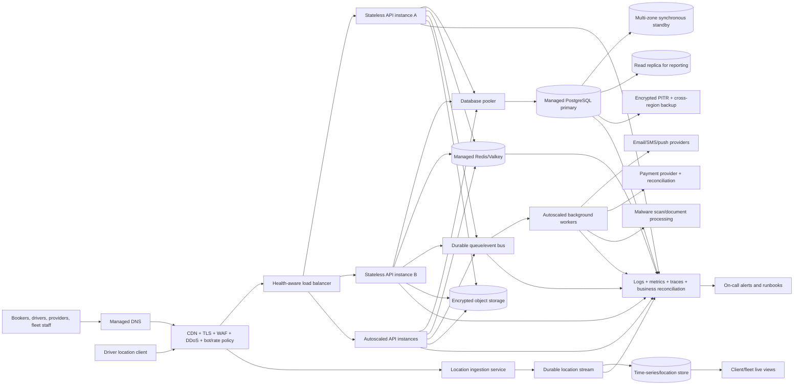

# LiftHaul production stability target architecture

Date: 2026-09-07  
Status: proposed design; **not implemented by the current Render blueprint**

## Required properties

### Edge and application

- At least two stateless API instances in different failure domains.
- Health checks remove unhealthy instances; autoscaling is bounded by capacity and cost alarms.
- Per-request database sessions come from a bounded pool. No process-global connection or global
  database mutex.
- Shared, proxy-aware, user/API-key-aware rate limiting in the managed key-value store. The load
  balancer must sanitize forwarding headers before the application trusts them.
- Non-critical reports, notifications, document processing, and reconciliation run in workers, not
  request threads.
- Readiness verifies database, queue, and required configuration without mutating production data.

### Booking and money

- Every command has a server-generated correlation ID and a caller-scoped idempotency key.
- Unique database constraints enforce booking, payment, release, refund, webhook, and assignment
  idempotency; read-before-write is never the only protection.
- State changes use database transactions and row/version locking. Payment release and dispute hold
  are one atomic decision.
- Transactional outbox records events in the same commit as the booking/payment mutation. Workers
  publish and mark them delivered with safe retry.
- Financial journals and provider webhook records are append-only and reconciled against the payment
  provider. Cached values never authorize payment status or release.

### Data services

- Managed PostgreSQL with multi-zone failover, encryption, slow-query telemetry, connection pooling,
  PITR, and restoration drills.
- Redis/Valkey only for sessions, rate limits, reference data, short-lived quote data, and safe
  aggregates. Cache loss must not lose bookings or money.
- Durable queue with dead-letter handling for notifications, reconciliation, document jobs, reports,
  webhooks, and audit-event delivery.
- Encrypted object storage for documents, cargo photos, and POD evidence; private by default with
  short-lived signed URLs, malware scan, hashes, retention, and versioning.
- Location events use a stream/time-series path. Do not update the main booking row for every raw GPS
  event and do not derive sequence numbers using `MAX(seq)+1` under concurrent ingestion.

## Failure isolation matrix

| Failed component | Required customer behavior | Required engineering behavior |
|---|---|---|
| One API instance | No visible outage | Load balancer removes it and maintains capacity |
| One availability zone | Brief or no interruption | API and database fail over within approved RTO |
| Primary database | Honest maintenance/pending state; no false success | Automatic failover; reconcile in-flight commands |
| Cache | Slower reads/re-auth where safe; no wrong money/status | Circuit break, rebuild, and preserve authoritative DB state |
| Queue | Booking/payment command retained; notifications delayed | Backpressure, durable enqueue, alarm, replay |
| Object storage | Booking retained; upload shown pending/failed honestly | Retry without duplicate metadata; quarantine incomplete upload |
| Map/geocoder | Addresses/draft retained; manual confirmation path | Timeout/circuit break; do not invent route/distance |
| Payment provider | Transaction stays pending; repeat click cannot duplicate | Idempotent session, polling/reconciliation, circuit break |
| SMS/email | Booking succeeds; message shown delayed | Durable retry/dead letter and alternate channel policy |
| Monitoring | Service continues but release gate is breached | Independent heartbeat and monitoring-on-monitoring alert |

## Environment and deployment standard

- Local, shared development, QA, performance, UAT, staging, production, and disaster-recovery
  environments have separate accounts/projects, databases, secrets, and service credentials.
- The performance environment uses the same database engine, pooler, cache, queue, object storage,
  network policy, worker model, and scaling rules as production at a representative scale.
- Infrastructure is version-controlled IaC with plan/apply review and drift detection.
- Deployments use canary or blue/green release, readiness gates, automatic rollback, and feature
  flags. Database migrations are expand/contract, backward compatible, and performed once by a
  controlled migration job rather than by every starting API instance.

## Observability contract

Every request, queue event, payment, booking, assignment, trip, and release carries the same trace or
correlation ID. Dashboards and alerts must expose:

- request rate, p50/p95/p99 latency, error/timeout rate, saturation, and instance health;
- database connections, locks, transaction duration, slow queries, replicas, and storage;
- cache hit ratio/evictions and queue age/depth/dead letters;
- booking success, safe vehicle recommendation, payment success, pending/duplicate webhooks,
  reconciliation mismatch, stuck release/refund, and location lag;
- dependency latency, retry count, rate limiting, and circuit-breaker state.

Critical alerts page an accountable owner and link to a tested runbook. A server-health dashboard
without business-transaction signals does not satisfy this standard.
